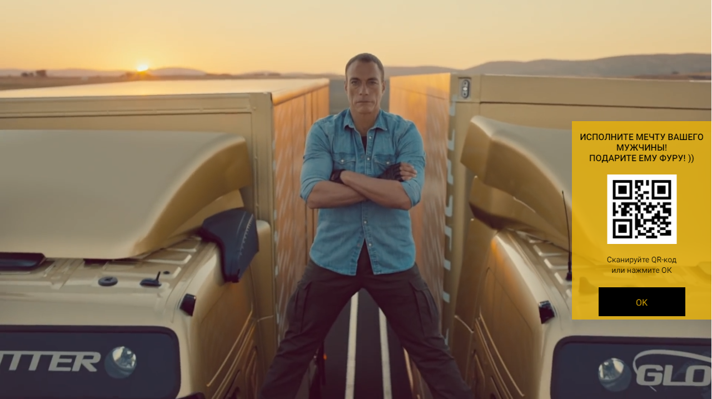

   
   

A test task represents a component of an app aimed to use on TV devices. Component resolution is 1280x720.
This project contains some features:
 * custom mobile number input;
 * arrow keys navigation;
 * mobile number validation(disabled);
 * idle function if there's no events.

Technologie i've been using:
  * React;
  * Next.js;
  * TypeScript;
  * Tailwindcss;
  
Project [demo](https://stunning-hamster-9d02f3.netlify.app/) version.
